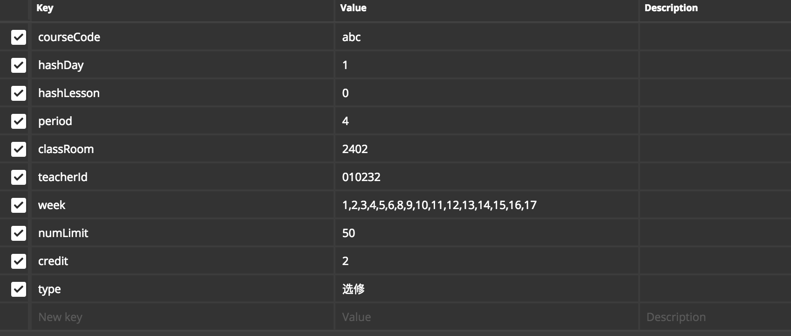
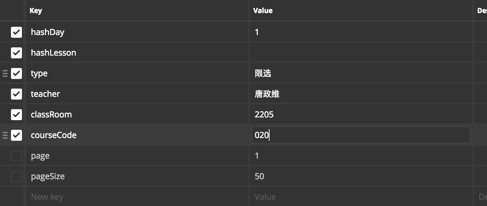
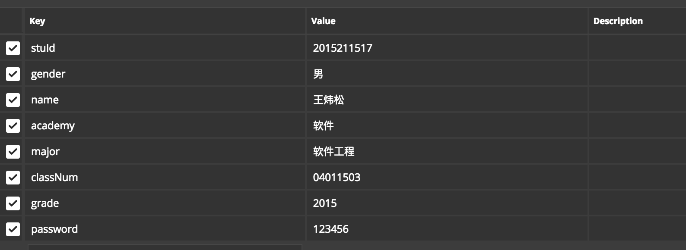
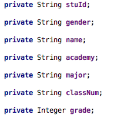
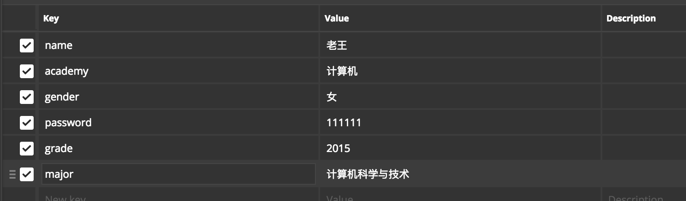
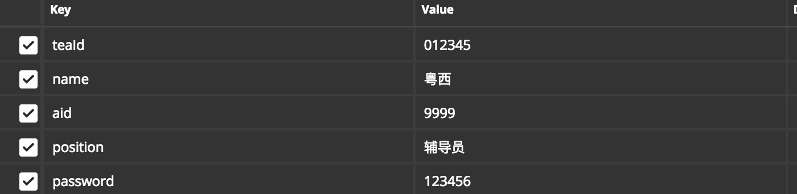
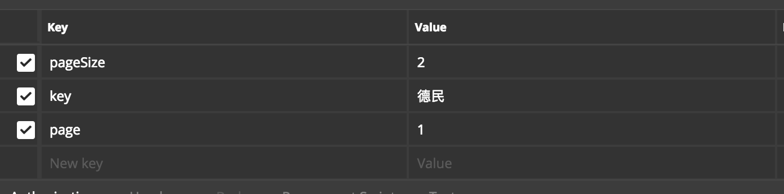

# 域名
123.206.211.185:8080/cs

## 说明
token 为用户登录成功所返回的凭证,每次调用接口需要带上
目前尚未接入这个功能,token值暂定为用户名

所有返回状态若```stauts```大于0,均表示发生了某些错误,```msg```有提示

url /```{}```里的为某个物的唯一标识

## 课程管理
### 查看课程分类 /admin/cmaps [get]
获取所有课程分类

+ request

		{
			token: admin,
			page: 1,
			pageSize: 50,
			key: ‘’ //均非必须,以上为默认值,若要查找带上key 
		}
+ response

		{
		    "status": 0,
		    "msg": null,
		    "data": {
		        "pageNum": 1,  // 分页数据
		        "pageSize": 2,
		        "size": 2, // 指定的每页数据大小
		        "startRow": 1, 
		        "endRow": 2,
		        "total": 891, // 符合条件的共有多少个
		        "pages": 446, // 总共多少页
		        "list": [ //数据
		            {
		                "id": 1,
		                "courseCode": "010435",
		                "courseName": "现代通信系统"
		            },
		            {
		                "id": 2,
		                "courseCode": "A1030040",
		                "courseName": "数据库系统应用"
		            }
		        ],
		        "prePage": 0, // 前一页
		        "nextPage": 2, // 后一页
		        "isFirstPage": true, // 是否第一页
		        "isLastPage": false, // 是否最后一页
		        "hasPreviousPage": false, // 是否有前一页
		        "hasNextPage": true, // 是否有后一页
		        "navigatePages": 8,
		        "navigatepageNums": [
		            1,
		            2,
		            3,
		            4,
		            5,
		            6,
		            7,
		            8
		        ],
		        "navigateFirstPage": 1,
		        "navigateLastPage": 8,
		        "firstPage": 1,
		        "lastPage": 8
		    },
		    "success": true
		}
		
### 新增课程分类 /admin/cmaps [post]
+ request

		{
			token: admin,
			courseCode: abc,
			courseName: '智商测试'
		}

+ response

		{
		    "status": 0,
		    "msg": null,
		    "data": null,
		    "success": true
		}

### 删除一个课程分类 /admin/cmaps/{courseCode} [delete]
+ request

		{
			token: 
		}

+ response

		{
		    "status": 0,
		    "msg": null,
		    "data": null,
		    "success": true
		}		

## 教学班管理
### 新增一个教学班 /admin/jxbs [post]



+ responsse
		
		{
		    "status": 1,  //这是错误,成功的话status=0
		    "msg": "该课程分类不存在",
		    "data": null,
		    "success": false
		}
		
### 根据课程号获取jxb信息 /admin/jxbs/{courseCode} [get]
例如 020498 

+ response

		{
		    "status": 0,
		    "msg": null,
		    "data": [
		        {
		            "id": 9,
		            "courseCode": "020498",
		            "jxbId": "SJ16172020498001",
		            "jxbName": "课程设计(微电子封装测试)",
		            "year": 181,
		            "hashDay": 0,
		            "hashLesson": 0,
		            "day": "星期一",
		            "lesson": "第1-4节",
		            "classRoom": "微电子工程中心封装及测试实验室1219",
		            "period": 4,
		            "teacherId": "020402",
		            "teacher": "唐政维  ",
		            "type": "实践",
		            "rawWeek": "18周",
		            "week": "18",
		            "numLimit": 50,
		            "currentNum": 1,
		            "credit": null,
		            "status": 0
		        },
		        {
		            "id": 10,
		            "courseCode": "020498",
		            "jxbId": "SJ16172020498001",
		            "jxbName": "课程设计(微电子封装测试)",
		            "year": 181,
		            "hashDay": 1,
		            "hashLesson": 0,
		            "day": "星期二",
		            "lesson": "第1-4节",
		            "classRoom": "微电子工程中心封装及测试实验室1219",
		            "period": 4,
		            "teacherId": "020402",
		            "teacher": "唐政维   ",
		            "type": "实践",
		            "rawWeek": "18周",
		            "week": "18",
		            "numLimit": 50,
		            "currentNum": 1,
		            "credit": null,
		            "status": 0
		        }
		    ],
		    "success": true
		}

### 按照教学班特征信息进行查找 /admin/jxbs [get]



+ response

		{
		    "status": 0,
		    "msg": null,
		    "data": {
		        "pageNum": 1,
		        "pageSize": 50,
		        "size": 1,
		        "startRow": 1,
		        "endRow": 1,
		        "total": 1,
		        "pages": 1,
		        "list": [
		            {
		                "id": 3,
		                "courseCode": "020400  ",
		                "jxbId": "A16172020400001",
		                "jxbName": "半导体工艺及器件仿真",
		                "year": 181,
		                "hashDay": 1,
		                "hashLesson": 0,
		                "day": "星期二",
		                "lesson": "第1-2节",
		                "classRoom": "2205",
		                "period": 2,
		                "teacherId": "020402",
		                "teacher": "唐政维  ",
		                "type": "限选",
		                "rawWeek": "3-10周",
		                "week": "3,4,5,6,7,8,9,10",
		                "numLimit": 50,
		                "currentNum": 0,
		                "credit": null,
		                "status": 0
		            }
		        ],
		        "prePage": 0,
		        "nextPage": 0,
		        "isFirstPage": true,
		        "isLastPage": true,
		        "hasPreviousPage": false,
		        "hasNextPage": false,
		        "navigatePages": 8,
		        "navigatepageNums": [
		            1
		        ],
		        "navigateFirstPage": 1,
		        "navigateLastPage": 1,
		        "firstPage": 1,
		        "lastPage": 1
		    },
		    "success": true
		}
		
### 更改教学班信息 /admin/jxbs/{jxbId} [put]
仅限更改教师,以及人数限制

+ request 例如:/admin/jxbs/A16172020400001
		
		{
			teacherId: '010232'
		}

+ response

		{
		    "status": 0,
		    "msg": null,
		    "data": null,
		    "success": true
		}
		
## 学生管理
### 新增一名学生 /admin/students [post]



+ response

		{
		    "status": 1,
		    "msg": "该学号或工号已存在",
		    "data": null,
		    "success": false
		}

### 获得学生列表 /admin/students [get]

+ request 
	
		{
			page: 1,
			pageSize: 50
			// 以下可选参数
		}


+ response

		{
		    "status": 0,
		    "msg": null,
		    "data": {
		        "pageNum": 1,
		        "pageSize": 1,
		        "size": 1,
		        "startRow": 0,
		        "endRow": 0,
		        "total": 1,
		        "pages": 1,
		        "list": [
		            {
		                "stuId": "2015211517",
		                "gender": "男",
		                "name": "王炜松",
		                "academy": "软件",
		                "major": "软件工程",
		                "classNum": "04011503",
		                "grade": 2015,
		                "headUrl": null,
		                "birthday": null
		            }
		        ],
		        "prePage": 0,
		        "nextPage": 0,
		        "isFirstPage": true,
		        "isLastPage": true,
		        "hasPreviousPage": false,
		        "hasNextPage": false,
		        "navigatePages": 8,
		        "navigatepageNums": [
		            1
		        ],
		        "navigateFirstPage": 1,
		        "navigateLastPage": 1,
		        "firstPage": 1,
		        "lastPage": 1
		    },
		    "success": true
		}
		
### 修改学生信息 /admin/students/{stuId} [put]



+ response 返回成功与否

### 删除一名学生 /admin/students/{stuId} [delete]
+ 返回成功与否

## 教师管理
### 新增一名教师 /admin/teachers [post]



+ response 
		
		{
		    "status": 1,
		    "msg": "该工号已被占用",
		    "data": null,
		    "success": false
		}
		
### 获得教师列表 /admin/teachers [get]
可根据key对teaId,name进行模糊查询



+ response

		{
		    "status": 0,
		    "msg": null,
		    "data": {
		        "pageNum": 1,
		        "pageSize": 2,
		        "size": 1,
		        "startRow": 1,
		        "endRow": 1,
		        "total": 1,
		        "pages": 1,
		        "list": [
		            {
		                "tid": null,
		                "teaId": "010201",
		                "name": "张德民  ",
		                "aid": "0100",
		                "major": "通信与信息工程学院",
		                "position": "教授",
		                "password": null
		            }
		        ],
		        "prePage": 0,
		        "nextPage": 0,
		        "isFirstPage": true,
		        "isLastPage": true,
		        "hasPreviousPage": false,
		        "hasNextPage": false,
		        "navigatePages": 8,
		        "navigatepageNums": [
		            1
		        ],
		        "navigateFirstPage": 1,
		        "navigateLastPage": 1,
		        "firstPage": 1,
		        "lastPage": 1
		    },
		    "success": true
		}
		
### 修改一个教师信息 /admin/teachers/012345 [put]

+ request

	{
		name:
		aid:
		password:
		position:
	}
	
+ response 成功与否

### 删除一个教师信息 /admin/teachers/012345 [delete]
+ response 成功与否

## 教师
### 获得课表 /teacher/courses/{tid} [get]
例如 /teacher/courses/020402

+ request 

		{
			week: 3 // 指定获得第几周的课表
		}
		
+ response

		{
		    "status": 0,
		    "msg": null,
		    "data": [
		        {
		            "courseCode": "020400  ",
		            "jxbId": "A16172020400001",
		            "jxbName": "半导体工艺及器件仿真",
		            "hashDay": 1,
		            "hashLesson": 0,
		            "day": "星期二",
		            "lesson": "第1-2节",
		            "classRoom": "2205",
		            "period": 2,
		            "teacherId": "020402",
		            "teacher": "唐政维  ",
		            "type": "限选",
		            "rawWeek": "3-10周",
		            "week": [
		                3,
		                4,
		                5,
		                6,
		                7,
		                8,
		                9,
		                10
		            ]
		        },
		        {
		            "courseCode": "020488  ",
		            "jxbId": "A16172020488001",
		            "jxbName": "半导体封装与测试",
		            "hashDay": 3,
		            "hashLesson": 0,
		            "day": "星期四",
		            "lesson": "第1-2节",
		            "classRoom": "2406",
		            "period": 2,
		            "teacherId": "020402",
		            "teacher": "唐政维  ",
		            "type": "限选",
		            "rawWeek": "3-6周,8-11周",
		            "week": [
		                3,
		                4,
		                5,
		                6,
		                8,
		                9,
		                10,
		                11
		            ]
		        }
		    ],
		    "success": true
		}

### 获得教学班学生名单
暂时有bug

## 学生
### 查看可选课程 /student/courses

+ response 

		{
		    "status": 0,
		    "msg": null,
		    "data": [
		        {
		            "courseCode": "020400",  //课程号
		            "courseName": "半导体工艺及器件仿真", //课程名
		            "jxbVos": [ // 该课程号下的教学班
		                {
		                    "courseCode": "020400",
		                    "jxbId": "A16172020400001",
		                    "jxbName": "半导体工艺及器件仿真",
		                    "day": "星期二",
		                    "lesson": "第1-2节",
		                    "classRoom": "2205",
		                    "teacher": "唐政维  ",
		                    "type": "限选",
		                    "rawWeek": "3-10周",
		                    "credit": null
		                },
		                {
		                    "courseCode": "020400",
		                    "jxbId": "SK16172020400001",
		                    "jxbName": "半导体工艺及器件仿真",
		                    "day": "星期三",
		                    "lesson": "第9-10节",
		                    "classRoom": "集成电路设计实验室(综合实验楼A203/A204)",
		                    "teacher": "唐政维  ",
		                    "type": "限选",
		                    "rawWeek": "4-11周",
		                    "credit": null
		                },
		                {
		                    "courseCode": "020400",
		                    "jxbId": "SK16172020400002",
		                    "jxbName": "半导体工艺及器件仿真",
		                    "day": "星期五",
		                    "lesson": "第7-8节",
		                    "classRoom": "集成电路设计实验室(综合实验楼A203/A204)",
		                    "teacher": "唐政维  ",
		                    "type": "限选",
		                    "rawWeek": "4-6周,8-12周",
		                    "credit": null
		                }
		            ]
		        },
		        {
		            "courseCode": "020488",
		            "courseName": "半导体封装与测试",
		            "jxbVos": [
		                {
		                    "courseCode": "020488",
		                    "jxbId": "A16172020488001",
		                    "jxbName": "半导体封装与测试",
		                    "day": "星期四",
		                    "lesson": "第1-2节",
		                    "classRoom": "2406",
		                    "teacher": "唐政维  ",
		                    "type": "限选",
		                    "rawWeek": "3-6周,8-11周",
		                    "credit": null
		                },
		                {
		                    "courseCode": "020488",
		                    "jxbId": "SK16172020488001",
		                    "jxbName": "半导体封装与测试",
		                    "day": "星期三",
		                    "lesson": "第5-8节",
		                    "classRoom": "微电子工程中心封装及测试实验室1219",
		                    "teacher": "唐政维  ",
		                    "type": "限选",
		                    "rawWeek": "9-12周",
		                    "credit": null
		                },
		                {
		                    "courseCode": "020488",
		                    "jxbId": "SK16172020488002",
		                    "jxbName": "半导体封装与测试",
		                    "day": "星期五",
		                    "lesson": "第9-12节",
		                    "classRoom": "微电子工程中心集成电路设计实验室1221",
		                    "teacher": "唐政维  ",
		                    "type": "限选",
		                    "rawWeek": "9-12周",
		                    "credit": null
		                }
		            ]
		        },
		        {
		            "courseCode": "Mooc57",
		            "courseName": "音乐鉴赏(Mooc)",
		            "jxbVos": [
		                {
		                    "courseCode": "Mooc57",
		                    "jxbId": "Mooc57a7182000-73ae-11e8-212d-e9b9b6cc80f3",
		                    "jxbName": "音乐鉴赏(Mooc)",
		                    "day": "星期一",
		                    "lesson": "第5-7节",
		                    "classRoom": "2102",
		                    "teacher": "粤西",
		                    "type": "选修",
		                    "rawWeek": "1-6周,8-16周",
		                    "credit": 2
		                }
		            ]
		        }
		    ],
		    "success": true
		}
		
### 选课 /student/cd.do [post]

+ request

		{
			token: // 此处填学号
			jxbId: // 教学班id
		}

+ response

		{
		    "status": 1,  // 进行了冲突判断
		    "msg": "与已选课程冲突",
		    "data": null,
		    "success": false
		}
		
### 学生课表 /student/courses/{stuId}
未完成